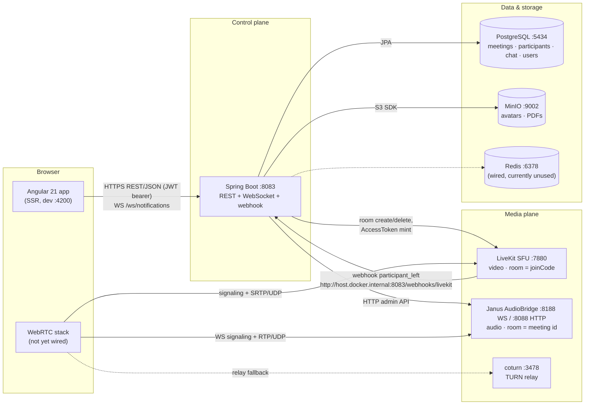
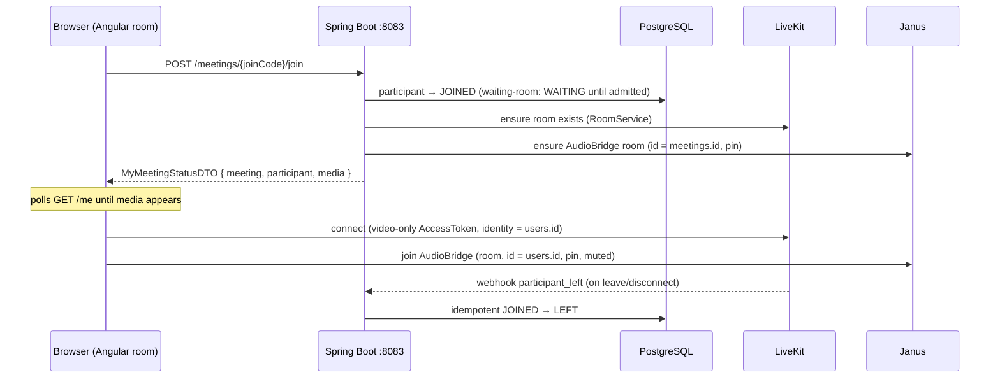

# Online Meeting Room — System Architecture

Umbrella overview of the whole system: the Spring Boot control plane, the split LiveKit/Janus media plane, the Angular meeting UI, and the backing data/infra services. Detail lives in the linked docs; this file is the map.

- **Status date:** 2026-10-03 · backend complete and unit-tested (90 tests), full Angular meeting UI in place, browser WebRTC not yet validated (see [Status & known gaps](#status--known-gaps)).

## Contents

1. [System overview](#system-overview)
2. [Repository layout](#repository-layout)
3. [Control plane — Spring Boot](#control-plane--spring-boot)
4. [Data layer](#data-layer)
5. [Media plane — LiveKit + Janus + coturn](#media-plane--livekit--janus--coturn)
6. [Frontend — Angular 21](#frontend--angular-21)
7. [Development topology](#development-topology)
8. [Status & known gaps](#status--known-gaps)
9. [Further reading](#further-reading)

## System overview

A meeting-room web app: registered users create instant or scheduled meetings, share a 10-character join code, and meet with waiting-room, moderation (mute / remove / promote / lock) and persisted chat. The system is split into a **control plane** and a **media plane**:

- The **control plane** (Spring Boot, port 8083) owns every state transition — identity, auth, meetings, participants, chat, credentials. All state lives in Postgres; the media servers hold nothing authoritative.
- The **media plane** moves the audio/video bytes and is deliberately split: **LiveKit** (SFU) carries video, **Janus AudioBridge** (MCU) mixes audio, **coturn** provides TURN relay. The browser connects to both directly using short-lived, narrowly-scoped credentials minted by the control plane.

The join-time handoff: the control plane commits the participant transition to Postgres **first**, then mints credentials and ensures the media rooms exist. Media state is best-effort; Postgres is the single source of truth ("DB wins" — see [Media plane](#media-plane--livekit--janus--coturn)).

## Repository layout

| Path | What it is |
| --- | --- |
| `server/` | Spring Boot 3.2.3 / Java 17 backend (`tech.getarrays.meetingroom`), `docker-compose.yml` dev stack, config under `docker/` |
| `server/docs/` | Deep-dive docs: media architecture, database design, implementation status, MinIO/Redis/WebSocket notes |
| `server/.claude/rules/`, `frontend/.claude/rules/` | Working conventions + full REST contract (api-surface.md / backend-api.md) |
| `frontend/` | Angular 21.2 app — standalone components, signals, SSR via Express |
| `architecture.md` | This file |

## Control plane — Spring Boot

Source: `server/src/main/java/tech/getarrays/meetingroom/` · full endpoint map: [`server/.claude/rules/api-surface.md`](server/.claude/rules/api-surface.md)

**Layering.** Thin controllers → services (all business rules; they throw) → `AllExceptionHandler` renders one error shape: `{status, message, timeStamp}`. Hand-rolled success acks go through `MeetingRoomUtils` as `{"messag": "..."}` — the key really is misspelled on the backend and mirrored deliberately in the frontend models. No bean validation on DTOs; input checks are manual in services (→ 400).

**Auth.** Stateless JWT: 15-minute **access token** (Bearer, signature secret hardcoded in `JwtUtil` for dev) + opaque 64-char **refresh token** (7 days, one row each in `refresh_tokens`) delivered in an HttpOnly cookie `asset-manager.refreshToken` (`SameSite=Strict`, `Path=/auth`). Refresh rotates server-side — replaying a rotated token 401s and revokes. Filter order per request: `JwtRequestFilter` (401 on bad Bearer) → `RateLimitFilter` (429 + `Retry-After` past ~3 req/s per identity). Public paths: `/auth/{login,signup,refresh,forgot-password,hello}`, `/ws/**`, `/webhooks/livekit` (the real gate there is LiveKit's signed-JWT check → 401).

**REST surface (one line per resource).**

| Resource | Base | Notes |
| --- | --- | --- |
| Auth | `/auth` | login/signup/refresh/logout/forgot/change-password; signup auto-logs-in |
| Users | `/users` | ADMIN-only list + status/role patches; `current-user` for the settings page |
| Images | `/images/avatar` | owner-scoped; bytes stream through the backend from MinIO |
| PDF files | `/pdf-files` | owner-scoped; multipart upload (1–10 × 20 MB), Blob download |
| Meetings | `/meetings` | create (INSTANT starts immediately; optional BCrypt-hashed join password → `hasPassword`), `/my` **hosted-only** paged list, get by joinCode, `PATCH /{id}/start·cancel·end` (numeric id; host-only) |
| Participation | `/meetings/{joinCode}/...` | join (403 password gate, host exempt) / `GET /me` (polling channel) / leave / lobby / admit / deny / roster / mute (self + moderator) / speaking (self, clamped while muted) / remove / lock / role — **all by joinCode** |
| Chat | `/meetings/{joinCode}/chat` | paged history (newest-first, per-viewer: broadcasts + own private traffic), send (optional `recipientUserId` = private), soft delete; readable after the meeting ends |
| Webhook | `/webhooks/livekit` | server-to-server only; signed; `participant_left` reconciles JOINED→LEFT |

Authorization inside meetings is **per-participant role** (HOST / COHOST / PARTICIPANT via `MeetingAuthority`), not the account role: hosts lock/end/promote; co-hosts also admit/remove/mute; the host row is immutable (409s).

**Realtime.** No per-user push yet — the room state is consumed by **polling** (`GET /meetings/{joinCode}/me`). A separate raw WebSocket `/ws/notifications?token=<accessJWT>` (handshake-interceptor authenticated, origin-pinned) broadcasts one global frame every 30 minutes to the header bell.

## Data layer

Source: [`server/docs/meeting-database-design.md`](server/docs/meeting-database-design.md) · schema is generated by `spring.jpa.hibernate.ddl-auto=update` (no migrations/Flyway).

**PostgreSQL** (`myrooms` @ :5434; enums as strings, naive `LocalDateTime`, plain FKs with no ON DELETE):

| Table | Purpose / shape |
| --- | --- |
| `meetings` | One row per meeting; unique 10-char `join_code` (external id, base32 no 0/O/1/I); `host_id` denormalized (powers `/my`); status `SCHEDULED→IN_PROGRESS→ENDED \| CANCELLED`; INSTANT meetings are born `IN_PROGRESS`; optional `password_hash` (BCrypt; DTO exposes only `hasPassword`) |
| `meeting_participants` | Roster **and** waiting room in one row per (meeting, user) — unique `(meeting_id, user_id)`; status `WAITING / JOINED / LEFT / REMOVED / DENIED / DECLINED` (rejoins reuse the row, `join_count++`); role `HOST / COHOST / PARTICIPANT`; `admitted_by_id`; `speaking` + `last_speaking_at` (mic-energy flag, clamped while muted, reset on leave/rejoin) |
| `meeting_chat_messages` | `content` ≤ 2000 chars, paged by `sent_at DESC, id DESC`; nullable `recipient_id` = private message (visible only to sender + recipient); **soft delete** (`deleted_at`/`deleted_by_id`) |
| `users`, `refresh_tokens`, `images`, `user_pdf_files` | Identity (unique email/accountNumber), rotating refresh tokens (unique token), one avatar per user (unique `user_id`), owner-scoped PDF metadata |

**MinIO** (`:9002`, dev console `:9003`): bucket `user-images` (keys `avatars/<userId>/<uuid>.<ext>`) and `user-pdf-files` (keys `pdfs/<userId>/<uuid>.pdf`). The browser never talks to MinIO — all bytes proxy through the backend (JWT-protected); MinIO bucket bootstrap makes it a hard startup dependency.

**Redis** (`:6378`): wired (`RedisCacheConfig`, Lettuce) but currently **vestigial** — nothing is `@Cacheable`. `server/docs/redis.md` / `redisson-bloom-filter.md` describe the sibling assetManager project, not this repo. Known mismatch: `application.properties` points at `6379` while compose publishes `6378`.

## Media plane — LiveKit + Janus + coturn

Source: [`server/docs/meeting-media-architecture.md`](server/docs/meeting-media-architecture.md)

**Why split.** Video is many-to-many → an SFU (LiveKit) forwards streams without decoding. Audio needs a single mixed downmix per participant → an MCU (Janus AudioBridge) mixes server-side at 48 kHz. One engine doing both would force either video through a mixer or audio through mesh.

| Concern | LiveKit (video) | Janus AudioBridge (audio) |
| --- | --- | --- |
| Room identity | room name = **joinCode** | room number = **meetings.id** (numeric) |
| Participant identity | JWT `identity` = `users.id` | AudioBridge `id` = `users.id` (what moderator mute/kick target) |
| Admission | AccessToken (TTL 5 min, video-only grants: `canPublishSources ["camera","screen_share"]`, no data channels) | HMAC-derived per-room secret/pin (`RoomSecretDeriver`, pepper in config) |
| Control | RoomServiceClient (create/delete, empty-room timeout 900 s) | HTTP admin API `:8088/janus` (`JanusAudioBridgeClient` over `JanusHttpTransport` — no SDK) |
| Browser transport | `:7880` HTTP/WS signaling + `50100-50200/udp` SRTP | `:8188` WS signaling + `51000-51100/udp` RTP |

**"DB wins" invariants.** Every control-plane write commits to Postgres first; media calls are best-effort follow-ups. Tokens are minted **only after** the DB says JOINED — credentials are the only door into the rooms. `locked` = stop minting tokens. LiveKit's `participant_left` webhook (signed, idempotent) flips JOINED→LEFT as reconciliation; the 900-second empty-room timeout is the orphan-room backstop. LiveKit's own chat/data channels are on a do-not-use list — chat is REST + Postgres so it survives the meeting.

## Frontend — Angular 21

Source: `frontend/src/app/` · conventions: `frontend/.claude/rules/`

Standalone components + **signals** for all state (no NgRx; RxJS only as one-shot HttpClient calls via `take(1)`). SSR via Express (built server on :4000), dev server on :4200, cross-origin to the API (`app.client.url` drives backend CORS). Plain SCSS with semantic CSS custom properties in `src/scss/theme.scss` (light/dark via `data-theme`), hand-rolled modal system driven by `ModalService` signals, i18n dictionary en/vi typed so a missing key fails the build.

**Auth client** (`interceptor/auth.interceptor.ts` + `AuthService`): access token **memory-only**; startup hydration does one blind cookie-refresh; the interceptor attaches Bearer only when live, proactively refreshes on expiry (single-flight), and retries a non-auth 401 once after refresh. The refresh cookie is HttpOnly — JS can never read it.

**Routes/pages:** dashboard, `meetings` (hosted list: create/start/cancel/end/copy code), `meetings/:joinCode/room`, pdf-files, users (admin), user-setting. Auth is modal-based (no `/login` route); guards open the login modal on denial.

**Meeting room store** (`service/meeting-room.service.ts`): with no per-user push channel, the room consumes state by **polling** under the 3 req/s budget — `GET /me` every 2 s, a roster chain every 2.5 s (carries the `speaking` flag for the stage indicator, so its cadence bounds feedback lag) and a strictly sequential lobby → chat-reconcile chain every 5 s while joined (≈1.4 req/s + throttled speaking PATCHes). 429/network errors back off to 10 s; 404/401 and terminal states (meeting ended/cancelled, participant removed/denied) stop the loops; `join()` restarts them. LiveKit tokens (5-min TTL) are re-read from every `/me` response, never cached. Speaking detection runs client-side (`service/speech-detection.service.ts`: getUserMedia + AnalyserNode RMS with hysteresis, browser-only, silently inert without mic permission) and reports transitions via `PATCH /participants/me/speaking`; the stage renders `stageParticipants` (self pinned first, active speakers immediately after, most recent first). Password-protected meetings prompt through a join-password modal (`join()` pre-flight + 403 retry). WebRTC SDKs are deliberately not wired yet — the room renders a roster-driven placeholder stage and a connection-info panel exposing `MediaCredentialsDTO` (token truncated).

**Notifications:** raw WebSocket to `/ws/notifications?token=<JWT>` with exponential-backoff reconnect and refresh-before-reconnect (`service/notification.service.ts`).

## Development topology

`server/docker-compose.yml` — six services, healthchecked, no `depends_on`; dev credentials are the compose defaults.

| Service | Image | Host ports | Purpose |
| --- | --- | --- | --- |
| db | postgres:16 | **5434**→5432 | `myrooms` database |
| minio | minio (RELEASE.2025-09-07) | **9002** (S3) / **9003** (console) | avatars + PDF buckets |
| redis | redis:7-alpine | **6378**→6379 | wired, currently unused |
| livekit | livekit-server v1.13.7 | **7880** + 50100-50200/udp | video SFU |
| janus | built from source (v1.4.2, `docker/janus/`) | **8188** (WS) / **8088** (HTTP) + 51000-51100/udp | audio MCU |
| coturn | coturn 4.18.0-r1 | **3478** + 61000-61100/udp | TURN relay (static-auth-secret; LiveKit's own TURN off) |

Plus, outside compose: **Spring Boot on 8083** (`server/mvnw spring-boot:run`) and **ng serve on 4200** (`frontend/npm start`). LiveKit's webhook targets `http://host.docker.internal:8083/webhooks/livekit`.

Gotchas (from `server/docs/implementation-status.md`): don't confuse Janus's HTTP **8088** with Spring's **8083**; Janus builds from source (~5 min the first time); Linux needs `extra_hosts: host.docker.internal:host-gateway` on livekit/janus; set `TURN_EXTERNAL_IP` for LAN dev; coturn 4.18 rejects the removed `--no-tls/--no-dtls` flags; macOS Docker's UDP-range forwarding is flaky.

## Status & known gaps

As of 2026-10-03 (details: [`server/docs/implementation-status.md`](server/docs/implementation-status.md)):

**Done.** Backend control plane + media integration, smoke-tested, 90 unit tests. Dev stack (LiveKit/Janus/coturn) up and healthchecked. Full Angular meeting UI — list/create/join modals, room with waiting room, lobby moderation, roster with role-gated actions, persisted chat, lock/leave/end — 240/240 frontend tests green.

**Pending.**

- **Browser WebRTC validation** — no browser has actually connected to LiveKit/Janus yet (two-tab join, host-mute on the bridge, mix-minus spike, cross-plane A/V sync). The `livekit-client`/Janus SDK integration is the next frontend milestone.
- **Live webhook verification** — `participant_left` signature validation is unit-tested; no real event has fired.
- **Per-user push** — lobby/mute victims are REST-polling by design; no WebSocket push channel for meeting events yet.
- Carried issues: `UserService.deleteUser` is a bare `deleteById` (will fail on FK once meeting rows reference the user), no `GET /users/{id}/avatar` for roster tiles, Janus WS CORS deliberately permissive until the client spike, the `"messag"` key typo, and the Redis 6378/6379 port mismatch.

## Further reading

- [`server/docs/meeting-media-architecture.md`](server/docs/meeting-media-architecture.md) — media plane design, invariants, do-not-use list
- [`server/docs/meeting-database-design.md`](server/docs/meeting-database-design.md) — full schema, state machines, authority table
- [`server/docs/implementation-status.md`](server/docs/implementation-status.md) — living status + operational notes
- [`server/.claude/rules/api-surface.md`](server/.claude/rules/api-surface.md) / [`frontend/.claude/rules/backend-api.md`](frontend/.claude/rules/backend-api.md) — the REST contract, both sides
- [`frontend/.claude/rules/architecture.md`](frontend/.claude/rules/architecture.md) — frontend conventions (auth chain, signals, modal pattern)
