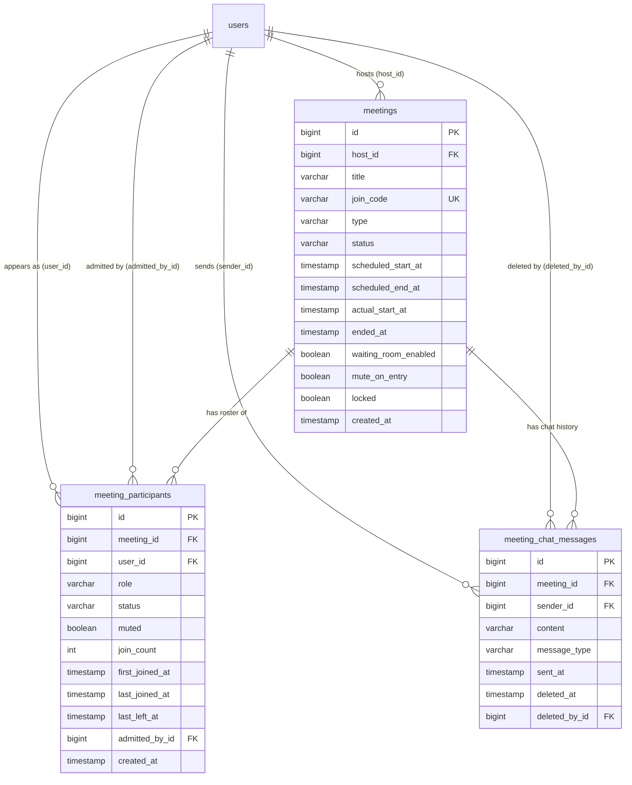
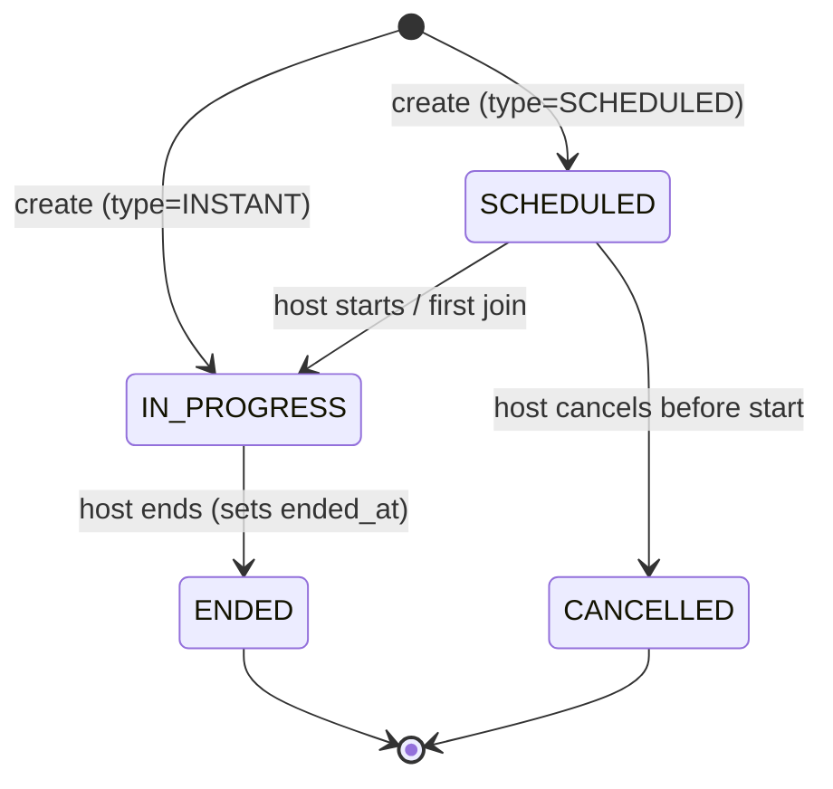
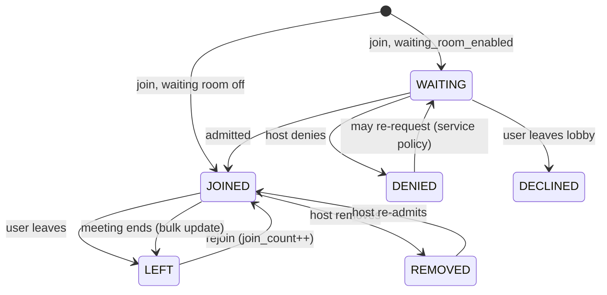

# Meeting-Room Database Design

The meeting domain stores **Zoom-style scheduled and instant meetings** with a unique join code each, a **waiting room with moderation** (admit/deny, remove, mute, lock), and **persisted in-meeting chat** viewable after the meeting ends. Registered users only — every participant is a foreign key to `users`; there is no guest path. The schema is three new tables — `meetings`, `meeting_participants`, `meeting_chat_messages` — created by `spring.jpa.hibernate.ddl-auto=update` on the next boot from the entities in `models/meeting/` (`Meeting`, `MeetingParticipant`, `MeetingChatMessage`) with repositories in `repo/` (`MeetingRepo`, `MeetingParticipantRepo`, `MeetingChatMessageRepo`). **This document + those entities/repos are the whole deliverable** — controllers, services, and DTOs come later; every rule marked *service-enforced* below is a contract the future service layer must own (the DB cannot express it).

## 1. Entity-relationship diagram



All timestamps are `timestamp without time zone` holding `LocalDateTime` — identical to every existing column (`users.created_at` etc.). Accepted trade-off: no timezone awareness (single-server dev app); switch to `timestamptz`/`Instant` before multi-region.

Every FK is a plain `REFERENCES ... (id)` with **no `ON DELETE` action** — Hibernate's schema update does not emit one, and this codebase's precedent is explicit bulk JPQL deletes from repos (see §6).

## 2. Table specs

### 2.1 `meetings` — one row per meeting (scheduled or instant)

| Column | Type | Null | Default | Notes |
|---|---|---|---|---|
| `id` | bigserial | no | — | PK |
| `host_id` | bigint | no | — | FK → `users(id)`; owner of the meeting |
| `title` | varchar(200) | no | — | |
| `description` | varchar(1000) | yes | — | |
| `join_code` | varchar(10) | no | — | **UNIQUE** (`uq_meetings_join_code`); see §5 |
| `type` | varchar(20) | no | — | enum `MeetingType { SCHEDULED, INSTANT }` |
| `status` | varchar(20) | no | — | enum `MeetingStatus { SCHEDULED, IN_PROGRESS, ENDED, CANCELLED }` |
| `scheduled_start_at` | timestamp | yes | — | required iff `type = SCHEDULED` (service-enforced — conditional nullability is not expressible in DDL) |
| `scheduled_end_at` | timestamp | yes | — | same rule; end is exclusive |
| `actual_start_at` | timestamp | yes | — | set when the meeting actually starts |
| `ended_at` | timestamp | yes | — | set when the host ends the meeting |
| `waiting_room_enabled` | boolean | no | false | meeting setting |
| `mute_on_entry` | boolean | no | false | meeting setting |
| `locked` | boolean | no | false | no new joins/re-admits while true |
| `password_hash` | varchar(100) | yes | — | BCrypt hash of the optional join password (null = open meeting). Never serialized — `MeetingDTO` exposes only `hasPassword` |
| `created_at` | timestamp | no | — | `@PrePersist` |

The entity also defaults `status` in `@PrePersist`: instant meetings are born `IN_PROGRESS`, scheduled ones `SCHEDULED`.

**Denormalization note:** `host_id` deliberately duplicates the HOST-role participant row. Host-ownership checks then follow the `UserUtils.checkOwnership` pattern without a join, and "meetings hosted by X" stays a single-table query. Rule 2 in §6 keeps the two in sync.

### 2.2 `meeting_participants` — roster + waiting room + moderation state

One row per (meeting, user). A user re-entering the meeting reuses the same row — `join_count` increments, `last_joined_at`/`last_left_at` move — so no per-join history table is needed at this scope (see §9 for the additive upgrade).

| Column | Type | Null | Default | Notes |
|---|---|---|---|---|
| `id` | bigserial | no | — | PK |
| `meeting_id` | bigint | no | — | FK → `meetings(id)` |
| `user_id` | bigint | no | — | FK → `users(id)` |
| `role` | varchar(20) | no | — | enum `ParticipantRole { HOST, COHOST, PARTICIPANT }` (`role` is unreserved — `users.role` already exists) |
| `status` | varchar(20) | no | — | enum `ParticipantStatus { WAITING, JOINED, LEFT, REMOVED, DENIED, DECLINED }` — **this is the waiting-room state machine** |
| `muted` | boolean | no | false | current audio state; persisted so it survives rejoin |
| `speaking` | boolean | no | false | mic-energy flag from the client's local speech detection; **clamped to false while `muted`** and reset on mute/leave/remove/end/rejoin (rule 8). `@ColumnDefault("false")` is required — `ddl-auto=update` adds NOT NULL columns without a DEFAULT and fails on a non-empty table |
| `last_speaking_at` | timestamp | yes | — | stamped only on the false→true transition; kept while silent — it sorts simultaneous speakers on the stage |
| `join_count` | int | no | 0 | incremented on each JOINED transition |
| `first_joined_at` | timestamp | yes | — | |
| `last_joined_at` | timestamp | yes | — | |
| `last_left_at` | timestamp | yes | — | set on LEFT/REMOVED |
| `admitted_by_id` | bigint | yes | — | FK → `users(id)`; who admitted from the waiting room (null = auto-admit / waiting room off) |
| `created_at` | timestamp | no | — | `@PrePersist` |

**UNIQUE (`meeting_id`, `user_id`)** (`uq_meeting_participants_meeting_user`). Exactly one HOST row per meeting is *service-enforced* — a partial unique constraint (`WHERE role = 'HOST'`) is not expressible in JPA annotations.

### 2.3 `meeting_chat_messages` — persisted in-meeting text chat

| Column | Type | Null | Default | Notes |
|---|---|---|---|---|
| `id` | bigserial | no | — | PK |
| `meeting_id` | bigint | no | — | FK → `meetings(id)` |
| `sender_id` | bigint | no | — | FK → `users(id)` (registered users only) |
| `recipient_id` | bigint | yes | — | FK → `users(id)`; **null = broadcast** — otherwise only sender and recipient ever see the row (visibility filter in `MeetingChatMessageRepo.findVisibleByMeetingAndViewer`). No index: the recipient predicate is a residual filter inside the `(meeting_id, sent_at)` scan (precedent: `admitted_by_id`) |
| `content` | varchar(2000) | no | — | plain text |
| `message_type` | varchar(20) | no | TEXT | enum `ChatMessageType { TEXT }` — single value today, kept so file-sharing/system messages later are an enum addition + optional attachments table, **not a migration** |
| `sent_at` | timestamp | no | — | `@PrePersist`; pagination key |
| `deleted_at` | timestamp | yes | — | **soft delete**: a message is visible iff `deleted_at IS NULL`; content retained for audit |
| `deleted_by_id` | bigint | yes | — | FK → `users(id)`; host or author |

No lookup/enum tables anywhere: every enum is stored as a string (codebase precedent), and the three meeting settings are booleans on `meetings` — three flags do not justify a settings table.

## 3. State machines

Meeting status (instant meetings are created `IN_PROGRESS`; "scheduled but never started and past `scheduled_end_at`" is a query filter, deliberately **not** a status — avoids a sweeper):



Participant status (`admitted_by` is set on the WAITING → JOINED transition):



Role transitions: `PARTICIPANT ⇄ COHOST` (promote/demote by host); **HOST is immutable**. Authority for waiting-room/mute/lock actions derives from `role` + the meeting settings — enforced in service code:

| Action | HOST | COHOST | PARTICIPANT |
|---|---|---|---|
| Admit/deny from waiting room | ✓ | ✓ | — |
| Remove participant | ✓ | ✓ (not HOST/COHOST) | — |
| Promote/demote co-host | ✓ | — | — |
| Mute others | ✓ | ✓ | — |
| Lock/unlock meeting | ✓ | — | — |
| End meeting | ✓ | — | — |

Rejoins (`LEFT/REMOVED → JOINED`) and re-admits are blocked while `meetings.locked = true`.

## 4. Join codes

- Alphabet: uppercase Crockford-style base32 without `0/O/1/I` — `ABCDEFGHJKMNPQRSTUVWXYZ23456789` (31 glyphs), 10 characters ≈ 31¹⁰ ≈ 8×10¹⁴ codes.
- The join code is the **only external identifier** — the internal `id` is never exposed in join links.
- Generation (service recipe): draw 10 secure-random glyphs; attempt insert; on a unique-constraint violation (astronomically rare, but it would 500) regenerate and retry, capped at a few attempts before surfacing an error.

## 5. Relationship & consistency rules (service-enforced)

1. **Meeting creation** is one transaction: the `meetings` row plus the host's `meeting_participants` row (`role=HOST`, `status=JOINED` for instant).
2. **Exactly one HOST participant per meeting**, and it must match `meetings.host_id`.
3. **Chat insert** requires the meeting `IN_PROGRESS` and the sender's participant row `status=JOINED` — no pre-/post-meeting chat.
4. **Meeting end** is one transaction: `status=ENDED` + `ended_at=now`, then `MeetingParticipantRepo.updateStatusForMeeting(meetingId, JOINED, LEFT, now)` bulk-moves every JOINED participant.
5. **Meeting deletion** is one transaction in order: `MeetingChatMessageRepo.deleteAllByMeetingId` → `MeetingParticipantRepo.deleteAllByMeetingId` → delete the meeting row.
6. Waiting-room/mute/lock policy (§3 table) and the single-HOST invariant (§2.2) live in the service layer — the DB cannot express them.
7. **Join password gate**: when `meetings.password_hash` is set, `join` rejects any caller except the host account without a password matching the hash (403; missing, blank, or wrong all equal). The gate sits in front of the join state machine and covers rejoins.
8. **Speaking clamp**: `speaking` is client-reported but never trusted past the mute flag — the service forces it false whenever `muted` becomes true, and resets it on every JOINED transition (rejoin/admit), leave/remove, and the bulk JOINED→LEFT of meeting end (`updateStatusForMeeting` sets it in the same statement). Only JOINED rows render, so a stale flag is invisible anyway; the resets are hygiene for reuse of the row.

## 6. User deletion & cleanup

`UserService.deleteUser` (landed 2026-10-03) is one `@Transactional` method — with FKs that have no `ON DELETE` action, every dependent row must be handled explicitly before `userRepo.delete(user)`. Semantics: **participants become tombstones, everything else the user owned dies with them**:

0. **Placeholder get-or-create** (lazy, no startup runner): `DELETED_USER@gmail.com` — name `DELETED_USER`, phone `0000000000`, `ROLE_USER`, status `"false"`, unusable random BCrypt password, `ACC-<uuid>`, BASIC `AccountLevel` get-or-create (mirrors signup). `saveAndFlush` so the bulk UPDATE below sees the row; creation is `synchronized` (a Postgres unique violation would abort the whole tx). The address is reserved — a real account that registered it first would receive tombstones (accepted dev-app risk).
1. **Hosted meetings die whole** (rule 5 order): for each `MeetingRepo.findByHostId(userId)` → `deleteAllByMeetingId` chat, then participants, then one `MeetingRepo.deleteAllByHostId`.
2. **Chat footprint erased**: `deleteAllBySenderId` + `deleteAllByRecipientId` (nulling `recipient_id` would make private messages broadcast-visible — visibility is `recipient IS NULL OR recipient = viewer OR sender = viewer`); `updateDeletedByToNull` (nullable audit ref, message stays soft-deleted).
3. **Participants become tombstones**: `deletePlaceholderRowsInMeetingsOf(placeholderId, userId)` first — clears `uq_meeting_participants_meeting_user` conflicts by dropping the placeholder's *older* tombstone row per shared meeting, so two deleted users in one meeting still leave exactly one tombstone — then `reassignToPlaceholder` sets `user = placeholder, role = PARTICIPANT, status = LEFT, lastLeftAt = now, speaking = false` (no JOINED/WAITING ghost in roster/lobby, no COHOST authority a tombstone can't exercise; the user's HOST rows are already gone via step 1). `updateAdmittedByToNull` (nullable display metadata — a tombstone can't have admitted anyone).
4. **Placeholder self-delete** (the account itself is deletable): its accumulated tombstone rows are hard-deleted (`deleteAllByUserId`) instead of reassigned — they cannot point at themselves.
5. **Owned rows**: `refresh_tokens` (`RefreshTokenService.deleteAllByUserId`), `user_pdf_files` + avatar row (bulk delete via `UserPdfFileService.deleteAllForUser` / `UserImageService.deleteAvatarForUser`, which return the MinIO object keys).
6. `userRepo.delete(user)` + `flush()` — FK failures surface **before** the best-effort MinIO object removals that follow (an orphaned object is recoverable, a row pointing at a missing object is not).

`MeetingParticipantRepo.deleteAllByUserIdAndRoleNot` was removed with this change — its "HOST rows stay behind" contract is superseded by hosted-meeting deletion running first. Deleting the host of an IN_PROGRESS meeting does not tear down the live media rooms (LiveKit `emptyTimeout` backstops); wiring media teardown into account deletion is a possible follow-up.

## 7. Indexes & query patterns

| Index | Table | Serves |
|---|---|---|
| `uq_meetings_join_code` (join_code) | meetings | join-link lookup (`findByJoinCode`) |
| `ix_meetings_host` (host_id) | meetings | "my meetings" list (paged) |
| `ix_meetings_status_start` (status, scheduled_start_at) | meetings | upcoming / history lists |
| `uq_meeting_participants_meeting_user` (meeting_id, user_id) | meeting_participants | membership check + rejoin lookup |
| `ix_meeting_participants_meeting_status` (meeting_id, status) | meeting_participants | lobby (WAITING) and live roster (JOINED) |
| `ix_meeting_participants_user` (user_id) | meeting_participants | "meetings I attended" + user cleanup |
| `ix_meeting_chat_meeting_sent` (meeting_id, sent_at) | meeting_chat_messages | chat pagination |
| `ix_meeting_chat_sender` (sender_id) | meeting_chat_messages | user-deletion cleanup |

FK columns are explicitly indexed because Postgres does not auto-index them. Chat pagination sorts `sent_at DESC, id DESC` — the `id` tie-break keeps pages stable across same-second messages (fixed server-side sort, same convention as the pdf-files list).

## 8. Extensibility (all additive under `ddl-auto=update`)

- **Recordings**: new `recordings` table FK → `meetings`, MinIO object key + metadata (mirrors `user_pdf_files`).
- **Recurring meetings**: nullable `series_id` FK on `meetings` to a new `meeting_series` parent holding the repeat rule.
- **Chat attachments**: extend `ChatMessageType` + an attachments table keyed by message id.
- **Per-join attendance history**: `meeting_participant_sessions` (one row per join session) if per-session durations ever matter — `join_count` + first/last timestamps cover reporting until then.
- **Guests**: would require loosening `user_id` FKs to nullable + a display-name column — out of scope by decision.

## 9. Caveats & non-obvious behavior

- **`ddl-auto=update` locks in first-boot constraints.** Nullability, uniqueness, FKs, and lengths of the three tables are effectively immutable once Hibernate creates them (adding columns works, altering constraints does not — `.claude/rules/database-schema.md`). Any later change is manual DDL against the dev DB.
- **`@Table(indexes = ...)` is new to this codebase.** Hibernate 6's schema update creates declared indexes for new tables, but verify on first boot (`\d meetings`); a missed index is a cheap manual `CREATE INDEX` in dev.
- **No `ON DELETE CASCADE` anywhere** — by precedent. `@OnDelete(action = CASCADE)` would emit it for these new tables, but it contradicts the bulk-JPQL convention and could never be applied to the *existing* `user_id` FKs, leaving deletion semantics half-implicit/half-explicit.
- **Reserved words avoided** — no column named `user`, `end`, `left`, `check`; hence `host_id`, `scheduled_start_at`, `ended_at`, `last_left_at`. `role`/`status`/`type` are unreserved and already proven in this exact DB (`users.role`, `users.status`).
- **Lombok `@Builder` + field defaults**: every defaulted field (`waitingRoomEnabled`, `muteOnEntry`, `locked`, `muted`, `joinCount`, `messageType`) carries `@Builder.Default` — without it `@Builder` silently zeroes the initializer.
- **One row per (meeting, user)** cannot answer "how long was each individual join session" — accepted at this scope (§8).
- **Single-HOST invariant and waiting-room policy are service-owned** (§2.2, §5) — the DB will accept two HOST rows if buggy code writes them.

## Quick manual check

```bash
docker compose up -d                       # Postgres 16 on host port 5434 (+ MinIO, Redis)
cd server && mvn spring-boot:run           # ddl-auto=update creates the three tables on boot
# then inspect (Ctrl+C the app first):
psql -p 5434 -U myuser myrooms -c '\d meetings'
psql -p 5434 -U myuser myrooms -c '\d meeting_participants'
psql -p 5434 -U myuser myrooms -c '\d meeting_chat_messages'
# expect: the FKs, uq_meetings_join_code, uq_meeting_participants_meeting_user,
#         and all ix_* indexes from §7
```
