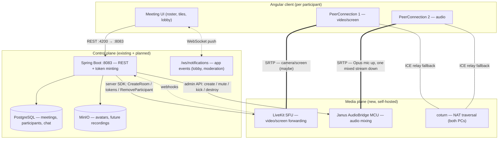

# Meeting Media Architecture: SFU Video + MCU Audio

This document specifies the media plane for the meeting domain and the technology decision behind it. The architecture is **decided**: each participant's media is split into a **video (visual) stream carried by an SFU** and an **audio stream carried by an MCU** that decodes every participant's Opus audio, mixes it into a single stream, and sends only that mix back. The meeting's *state* already lives in Postgres (`docs/meeting-database-design.md`, entities in `models/meeting/`) — **no schema change is needed**; every control the media plane must enforce (`waiting_room_enabled`, `mute_on_entry`, `locked`, `muted`, participant statuses) already has a column. Spring Boot stays the control plane; the media plane is new, self-hosted, open-source infrastructure in docker-compose. **This doc is design + recommendation only** — compose entries, `application.properties`, services, and client code land with implementation, exactly as the database design doc carried its "entities + repos only" banner.

## 1. Architecture overview



Per participant, the directions that carry the whole rationale:

```
                 one participant (browser)
                 ┌────────────────────────────────────────────────┐
   upstream      │ mic    ──► [PC2 → Janus MCU]   1 × Opus ~32kbps │  always
                 │ camera ──► [PC1 → LiveKit SFU] 0..1 video track │  usually absent
                 │ screen ──► [PC1 → LiveKit SFU] 0..1 share       │  rare
                 ├────────────────────────────────────────────────┤
   downstream    │ [PC2 ← Janus MCU]   1 × mixed audio, always     │  O(1) in room size
                 │ [PC1 ← LiveKit SFU] K × video (K = active cams) │  tracks active publishers
                 └────────────────────────────────────────────────┘
```

| Concern | Owner | Rule |
|---|---|---|
| Meeting truth (status, roster, roles, mute, lock) | Postgres | DB transitions commit **first**; media calls are best-effort, logged, never roll back the DB |
| Moving video bytes | LiveKit SFU | Selective forwarding — cost tracks *active publishers*, not room size |
| Mixing + moving audio bytes | Janus AudioBridge MCU | N Opus streams in → 1 mixed stream out per participant |
| Getting through NAT | coturn | Shared by both PeerConnections |
| Admission into either media server | Spring Boot | **Tokens are the only door** — minted only after the DB says the participant is `JOINED`. Postgres is the single gatekeeper |

## 2. Why the split plane

The two media types have opposite shapes, so they get opposite servers:

| Need | Video (camera + screen) | Audio (mic) |
|---|---|---|
| Bitrate per source | 150 kbps – 2.5+ Mbps | ~32 kbps (Opus) |
| Sparseness in this app | Most participants publish **nothing** — the UI shows their profile picture (§6), so an SFU forwards zero bytes for them | Always on for every participant |
| Per-viewer variation | Yes — simulcast layers, adaptive streaming, offscreen-tile pausing | None — one mix fits all |
| Server cost of decode+combine | Enormous — full-fps decode of every stream, compositing a grid, re-encoding | Trivial — Opus decode/mix/encode is cheap DSP |

The counterfactuals make the choice sharp. A **video MCU** would have to decode every stream, composite, and encode one grid — and would send that full composite to every viewer *even when every camera is off*, which directly contradicts this app's sparse-video reality. An **audio SFU** would hand each participant N−1 separate streams — N decoders and N audio elements per browser for ~32 kbps each, when a single server-side mix costs one Opus encode and returns one stream whose downlink is constant regardless of room size. So: video forwards selectively (SFU), audio mixes centrally (MCU).

## 3. Technology recommendation

Self-hosted open source only (must drop into the existing docker-compose dev stack). Candidates actually evaluated:

| | LiveKit | Janus | mediasoup | Jitsi/JVB | FreeSWITCH | Kurento |
|---|---|---|---|---|---|---|
| License | Apache-2.0 | GPLv3 (fine self-hosted) | ISC | Apache-2.0 | MPL-family | Apache-2.0 |
| Video SFU quality | simulcast + SVC + adaptive streaming | videoroom forwarding; weaker adaptive layer selection | raw engine, excellent | good, but product-coupled | — | decayed |
| Built-in audio MCU | none | **AudioBridge: Opus mix, one stream out, admin mute, talking events, recording** | **none — custom mixing required** | no single mix | yes, but telephony-first | decayed |
| Rooms/permissions | yes — rooms, participants, token grants | plugin-level only | **you build all of it** | whole-stack assumption | dialplan | — |
| Spring integration | **official `io.livekit:livekit-server` on Maven** (AccessToken, RoomServiceClient, webhooks) | WS JSON, no Java SDK — hand-rolled client | Node library → adds a Node service | Colibri REST, awkward standalone | ESL/fs_api, heavy | dead |
| Browser client | **`livekit-client` — maintained TS/npm** | `janus.js` global-script, bundler-hostile | mediasoup-client (fine) | lib-jitsi-meet, app-coupled | not WebRTC-first | dead |
| Docker ops here | one container + yaml config | one container + jcfg | the service you write | multi-piece (Prosody/Jicofo/…) | heavy | unmaintained |
| **Verdict** | **video plane (primary)** | **audio plane (primary) + consolidation alt.** | documented in depth (§10) | reject | reject | reject |

### Primary: LiveKit (video SFU) + Janus AudioBridge (audio MCU) + coturn

1. **The backend stays Java-only.** The official Maven SDK (`io.livekit:livekit-server`) means no Node sidecar for signaling — mediasoup fails exactly here.
2. **Postgres-owned admission maps 1:1 onto credential minting.** LiveKit is token-gated (JWT grants) and AudioBridge is pin-gated (per-room pin); the waiting room, lock, and removal semantics already designed into `meetings`/`meeting_participants` enforce themselves at the edge. LiveKit JWT grants additionally let the *server* enforce video-only participation (`canPublishSources: ["camera", "screen_share"]`, `canPublishData: false` — the source allowlist excludes the microphone) instead of trusting the client.
3. **The Angular 21 client gets a first-class npm library** for the harder UX (screen share, simulcast layer switching, adaptive quality). The audio client surface is tiny — join/configure/mute/talking-events — so a hand-rolled typed WebSocket client (§6) is a feature, not a liability.
4. **AudioBridge is the only battle-tested, self-hostable OSS audio MCU** that drops into compose: per-participant and room-wide admin `mute` implement host authority *server-side*; `talking` events feed the active-speaker UI; WAV/MJR recording and `rtp_forward` of the mix are ready hooks for future transcription/recording.
5. **Sparse-video economics.** SFU egress tracks active publishers; with the avatar-when-no-video UX most participants publish no video at all (§8).

### Alternative A — Janus-only (consolidation exit)

One Janus container runs `videoroom` (SFU video) **and** AudioBridge (MCU audio): one server, one signaling protocol, one admin surface. Trade-offs: no Java SDK (Spring hand-rolls the signaling client), weaker simulcast/adaptive-video behavior than LiveKit, and the bundler-hostile `janus.js` client. **Written decision trigger:** switch if operating two media servers (or the two-PeerConnection client cost, §9) becomes the dominant pain. Everything in §5's control-plane design carries over — only the video-plane API calls change.

### Rejected

| Candidate | Disqualifier |
|---|---|
| Jitsi/JVB | Designed as a bundled product (Prosody + Jicofo + web client); standalone JVB with a custom client fights the grain — and no single mixed-audio stream exists |
| FreeSWITCH | Capable conference MCU but telephony-first; famously heavy operations for this need |
| Kurento | Unmaintained for years — excluded regardless of its MCU capabilities |

mediasoup is **not rejected** — it is documented as a full alternative in §10.

## 4. Component responsibilities & contracts

### 4.1 LiveKit (video plane)

- **Room = `join_code`** (created at meeting start, deleted at end). The internal `meetings.id` is never a room name.
- **Spring is the only holder of the API key/secret.** It calls `RoomServiceClient` (`createRoom` with a bounded `emptyTimeout` ≈ 15–30 min, `deleteRoom`, `removeParticipant`) and mints short-TTL AccessTokens.
- **Token grants** (video-only by construction): `roomJoin: true`, `room: <join_code>`, `canSubscribe: true`, `canPublishSources: ["camera", "screen_share"]`, `canPublishData: false`, `identity: <users.id as string>` (the identity is what `removeParticipant` targets), display `name`. Note: the Kotlin SDK has no `canPublishAudio` grant — `CanPublishSources` supersedes it, so restricting sources to camera + screen_share excludes `microphone`/`screen_share_audio` server-side (same effect, different mechanism).
- **Webhooks** → `POST /webhooks/livekit` (path permitted at the Spring level, LiveKit's signed-JWT `Authorization` header validated in the endpoint — same permitAll-delegates-to-the-real-check pattern as `/ws/**`). Consumed events: `participant_joined`, `participant_left`, `room_finished`.
- **Do-not-use list:** LiveKit's built-in chat, data channels, and participant metadata-as-roster. The app owns chat (`meeting_chat_messages`) and the roster (`meeting_participants`); LiveKit participants are a *projection*, not a source.

### 4.2 Janus AudioBridge (audio plane)

- **Room = numeric `meetings.id`** — AudioBridge room ids are numeric and `join_code` is base32; the doc calls out this asymmetry deliberately: video room is keyed by the external id, audio room by the internal one.
- Browser connects **directly** to Janus's WebSocket (:8188). No token-auth plugin: each room is created with a per-room **secret** (admin ops — derived deterministically by `RoomSecretDeriver`, held only by Spring; a secret-carrying joiner would become an unmuteable admin, so it never reaches a client) and a random **pin** (join credential, handed to admitted clients with the room id). Participants join with `{request:"join", room, id: <users.id>, pin, display, muted}` — the explicit `id = users.id` convention means every admin op (`mute`, `kick`) targets users by id with no feeder lookup. Janus's WebSocket origin check must allow the frontend origin, mirroring the existing `/ws/notifications` origin handling.
- Message surface the app uses: `create` (at meeting start, carrying `admin_key` + `secret` + `pin`), `join` (with `muted: true` when `mute_on_entry`), `configure` (self mute), `mute` / `unmute` (admin, by user id + `secret`), `kick` (verified request name), `mute_room` (all), `destroy`, `exists` (idempotent ensure), `leave`, plus the `talking` events AudioBridge emits (audio-level extension → `talking` flag) for active-speaker UI.
- **Future hooks, not used yet:** mixed-audio WAV recording and `rtp_forward` of the mix to an external RTP pipeline (transcription, recording to MinIO).
- Janus has **no outbound webhooks** — audio-plane presence is derived from the app's own admission records (`status=JOINED`); `listparticipants` exists if a reconciliation view is ever needed.

### 4.3 Spring Boot (control plane — new `services/media/` concept at implementation time)

Mint-after-admission only; webhook receiver; the single holder of both secrets (`app.livekit.*`, `app.janus.*`).

### 4.4 coturn

Shared TURN/STUN for both PeerConnections. Mandatory in practice: participants behind symmetric NAT can only complete ICE via relay. LiveKit passes TURN credentials to clients through its config; Janus gets the same TURN server via ICE settings.

### 4.5 Duplication pitfalls (who wins when state overlaps)

| Overlap | Rule |
|---|---|
| `meetings.status` vs LiveKit room existence | **DB wins** — the LiveKit room is a projection; `emptyTimeout` is the self-cleaning backstop, a reconciliation sweep is future hardening |
| `meeting_participants` rows vs LiveKit participants | **DB is the roster**; webhooks are sensors that trigger idempotent transitions |
| `meeting_participants.muted` vs AudioBridge mute state vs client mic intent | **DB survives rejoin** (the column's stated purpose); server-side `mute` enforces it at the bridge |
| Active speaker | **AudioBridge `talking` is THE source** — ignore LiveKit's motion-based active-speaker detection |

## 5. Control-plane flows

Shared invariants: authority comes from the permission table in `docs/meeting-database-design.md` §3 (HOST: admit/deny, remove, promote/demote, mute others, lock, end · COHOST: admit/deny, remove, mute others · PARTICIPANT: self only); every DB transition commits **before** any media API call; media failures are logged and retried best-effort, never propagated into the DB transaction.

### 5.1 Meeting start

```
host            Spring :8083                    LiveKit                    Janus
 │ POST create/start                │                             │             │
 │────────────────────────────────► │ txn: meetings row + HOST    │             │
 │                                  │ participant (JOINED) COMMIT │             │
 │                                  │ createRoom(join_code,       │             │
 │                                  │   emptyTimeout=15–30m) ────►│ room up     │
 │                                  │ audiobridge create(         │           room up
 │                                  │   room=meetings.id) ────────────────────► │
 │ ◄── host tokens (LK JWT + Janus) │                             │             │
```

| Step | DB write | LiveKit | Janus | Authority |
|---|---|---|---|---|
| Create/start | `meetings.status → IN_PROGRESS`, `actual_start_at`; host participant `JOINED` | `createRoom` | `create` | HOST |

### 5.2 Join (with waiting room)

`POST /meetings/{joinCode}/join` (JWT) — resolves the meeting **by join_code, never by id**; rejected if `status != IN_PROGRESS` or `locked = true`. With `waiting_room_enabled = false`: participant upserted `JOINED` (timestamps, `join_count++`) and **both tokens returned in the response**. With `waiting_room_enabled = true`: participant `WAITING`, **no tokens issued**. Known gap, flagged: the host cannot be pushed a lobby notification over today's `/ws/notifications` (global broadcast only — `docs/websocket.md`); either extend the handler to per-user sends (the extension path websocket.md already names) or the host polls the WAITING list (already indexed: `ix_meeting_participants_meeting_status`).

### 5.3 Admit

```
HOST/COHOST     Spring                            DB                media servers
 │ POST admit {userId}               │                │                  │
 │──────────────────────────────────►│ txn: WAITING→JOINED,              │
 │                                   │  admitted_by=caller,             │
 │                                   │  first/last_joined_at,           │
 │                                   │  join_count++,                   │
 │                                   │  muted = mute_on_entry OR prior  │
 │                                   │        COMMIT                    │
 │ ◄── nothing yet — the admitted client picks up credentials on its next │
 │     /me poll: LK JWT (TTL ≤5 min) + AudioBridge room id + pin          │
```

**JOINED means admitted, not connected** — the DB deliberately has no presence column; connectivity is a LiveKit webhook fact (`participant_joined`), recorded as nothing more than UI state. `muted = mute_on_entry OR prior muted` implements both the setting and mute-survives-rejoin in one expression; the AudioBridge join carries `muted: true` accordingly.

### 5.4 Mute

- **Self-mute:** client sends AudioBridge `configure {muted: true}` immediately (latency first — the mic stops feeding the mix at once), then `PATCH` persists `muted = true` so it survives rejoin.
- **HOST/COHOST mutes another:** authority check → server-side AudioBridge admin `mute` (the mix drops the feeder — the muted client cannot un-muted-by-republishing) → `muted = true`. The victim's mic UI updates via the per-user push channel (same gap as 5.2) or roster poll.
- **Mute all:** `mute_room` + same DB column for each.
- **Camera off is client-side track mute on LiveKit only.** `muted` is an *audio-only* column by design; video state is ephemeral presence observable via track events and never persisted.

### 5.5 Lock

HOST sets `meetings.locked = true` → the service simply **stops minting tokens** for anyone not already `JOINED`. No media-server call: the token gate *is* the enforcement. Unlock reverses it.

### 5.6 Remove

Txn `JOINED → REMOVED`, `last_left_at` → LiveKit `removeParticipant(join_code, identity, revokeTokenTs = now)` (disconnects and revokes every token issued before now) + AudioBridge `kick(room, id = users.id, secret)`. Race noted: a removed participant holding a live token could reconnect until revocation lands — short TTLs (≤5 min) bound the window.

### 5.7 End

The DB design's rule-4 transaction (`status = ENDED`, `ended_at`, bulk `JOINED → LEFT`) → `deleteRoom(join_code)` (fires `room_finished`, disconnects everyone) + AudioBridge `destroy(meetings.id)` + revoke all issued tokens. Ordering: DB first; media teardown best-effort with logged failures; `emptyTimeout` is the orphan-room backstop.

## 6. Client integration (Angular 21)

- **Two PeerConnections behind one facade.** `MeetingMediaService` wraps `service/livekit.service.ts` (npm `livekit-client`) and `service/audio-bridge.service.ts` — a small **hand-rolled typed WebSocket client** speaking Janus's JSON protocol directly; `janus.js` is a global-script library and a poor npm citizen, so it is deliberately not a dependency. The audio protocol surface (session → attach → join → configure → events) is small enough that typed wrappers are cheaper than the shim.
- **Avatar-when-no-video pattern:** the roster comes from the app's own API (DB-driven), never from LiveKit metadata. A video tile renders **iff** a subscribed remote video track exists and is unmuted; otherwise the tile shows the participant's MinIO avatar with an initials fallback (the header-avatar convention). Gap flagged: `GET /images/avatar` is owner-scoped today — the roster needs other users' avatars via a future `GET /users/{id}/avatar`, streamed through Spring (MinIO is never exposed to the browser, per the api-surface convention).
- **SSR/zoneless guards:** the app ships `@angular/ssr` — all media code behind `isPlatformBrowser`; SDK callbacks write into signals.
- **`environment.ts` additions:** `liveKitUrl`, `janusWsUrl`. Tokens are always fetched from the API at admission time, never embedded in the bundle.

## 7. Deployment (design — lands with implementation)

Compose additions follow house conventions (`myrooms-*` container names, pinned images, `restart: always`, healthchecks, explicit host:container maps):

| Service | Image | Host ports | Key config |
|---|---|---|---|
| `livekit` | `livekit/livekit-server:<pin>` | `7880:7880/tcp` (HTTP+WS signaling), `50100-50200:50100-50200/udp` (RTC range, narrowed from the 50000-60000 default) | yaml config: `keys` (shared with Spring), `rtc.port_range_start/end: 50100/50200`, embedded TURN **disabled** (coturn owns 3478) |
| `janus` | `myrooms-janus:1.4.2` — **built from source** via `docker/janus/Dockerfile` (no official Meetecho image exists; community images are stale or untagged) | `8188:8188/tcp` (WS), `8088:8088/tcp` (HTTP admin), `51000-51100:51000-51100/udp` (RTP, narrowed from 20000-40000) | two jcfg overrides mounted whole-file over the stock configs: AudioBridge (`admin_key`, `rtp_port_range`, talking events) + WebSocket transport (8188, origin allowlist); per-room secret/pin via the API, no token-auth plugin |
| `coturn` | `coturn/coturn:<pin>` | `3478:3478/udp` + `3478:3478/tcp`, `5349:5349/tcp` (TLS, optional dev), `61000-61100:61000-61100/udp` (relay) | `--lt-cred-mech --realm --static-auth-secret --min-port 61000 --max-port 61100 --external-ip <LAN_IP>` |

Port audit (no collisions; incumbents: 4200 frontend, 8083 API, 5434 PG, 9002/9003 MinIO, 6378 Redis): additions are 7880, 8188, 8088, 3478, 5349 + three UDP ranges. **Watch the 8088 (Janus admin) vs 8083 (API) visual confusion.** `application.properties` gains (house format, commented): `app.livekit.ws-url`, `app.livekit.api-key`, `app.livekit.api-secret`, `app.janus.ws-url`, `app.janus.admin-secret`. macOS note: Docker Desktop's UDP-range forwarding is the flakiest part of local WebRTC dev — test on a real network/LAN device before doubting the architecture.

## 8. Capacity & scaling

- **Audio (MCU):** Opus ≈ 32 kbps. Each client: 1 stream up, 1 mix down — **O(1) per client regardless of room size or speaker count**. Server: N × 32 kbps in, one mix out per meeting. A 30-person meeting ≈ ~1 Mbps each way. Trivial.
- **Video (SFU, sparse):** server egress = Σ selected simulcast layers per subscriber. Worked example — 10-person meeting, 2 cameras on (low layer ≈ 150 kbps each) + 1 screen share (≈ 1.5 Mbps): ≈ 1.8 Mbps per viewer, ≈ 16 Mbps total egress; the 8 camera-off participants contribute **exactly zero**. Adaptive streaming pauses offscreen tiles, pushing it lower. All-cameras-on is the worst case an SFU exists for.
- **MCU-video counterfactual, numerically:** decode 10 inbound streams, composite a grid, encode ~2–3 Mbps, and send that composite to **all 10 viewers** — even in the all-cameras-off meeting, where this architecture sends zero video bytes.
- **CPU shapes:** AudioBridge = O(N) Opus decodes + O(1) encode per room (a confirmed need for per-participant mix-minus would make it N encodes — one reason the §9 spike matters early). LiveKit forwarding cost scales with publisher→subscriber pairs, not room size.
- **TURN worst case:** every client relayed ⇒ coturn box carries ~2× transit (in + out).
- **When to cascade:** one node serves dev/small-scale comfortably. AudioBridge has native room cascading for large audiences; LiveKit multi-node requires its own Redis (unrelated to the 6378 cache instance). Explicit non-goal: no multi-node work until a real meeting saturates a real box.

## 9. Caveats & non-obvious behavior

1. **Mix-minus spike (top item).** AudioBridge docs describe a *full* mix; whether a participant hears themselves is undocumented — verify in an implementation spike. Browser AEC mitigates either way; a full mix that proves objectionable forces per-participant mixing (N encodes) and a re-read of §8's CPU row.
2. **Two PeerConnections per client:** 2× ICE/DTLS handshakes, double TURN allocations, two reconnect paths, two SDK surfaces, modest mobile CPU/battery cost. Mitigations: one facade service, one shared coturn, colocated containers. Upside: **audio survives a video-plane outage** — independent failure is also resilience.
3. **Cross-PC A/V sync:** the same speaker's video (LiveKit) and voice (Janus mix) have no browser mechanism to sync — lip-sync drift is possible. Accepted risk; verify perceptibility in the spike.
4. **Echo/AEC:** the mix playout is the AEC reference; encourage headphones and consider defaulting `mute_on_entry` on.
5. **Two media servers = two upgrade paths and two monitoring surfaces.** The Janus-only alternative (§3) is the documented exit; its decision trigger is written there.
6. **Per-user push gap:** today's WebSocket broadcast cannot target the host (lobby) or a mute victim — extend to per-user sends (websocket.md's own extension path) or poll.
7. **Roster avatar gap:** `/images/avatar` is owner-scoped; the roster needs a future `GET /users/{id}/avatar` (§6).
8. **Reconciliation races:** LiveKit allows ~15 s of grace before `participant_left`; policy — `participant_left` triggers an idempotent `JOINED → LEFT`, and the rejoin path (`join_count++`) already exists.
9. **Token hygiene:** short TTLs (≤5 min), revoke on remove/end; a removed participant with a live token can reconnect until revocation lands.
10. **Janus specifics verified at implementation time:** `kick` is the request name; per-room `secret`/`pin` replaced the token-auth plugin (simpler, same authority model); `enforce_cors` on the WS transport starts permissive — tighten after the client integration spike.
11. **License note:** Janus is GPLv3 — fine self-hosted; revisit only if the product is ever distributed as a hosted binary.
12. **No schema change** — stated as a positive: the DB design already carries every control column the media plane needs.

## 10. Alternative B: mediasoup + custom audio mixing (in depth)

The same split architecture, but one **Node.js media service owns both planes** on a single `mediasoup` worker: the browser opens **one** PeerConnection again (video tracks and the mixed-audio consume live on the same WebRtcTransport), Spring remains the control plane, and the audio MCU is code you write instead of a container you run.

```
Angular ── one PC (video + mic) ──► Node media service
                                      │  per room: mediasoup Router
                                      │   ├─ WebRtcTransports (browser PCs)
                                      │   ├─ video: plain SFU forwarding (worker-native, simulcast supported)
                                      │   └─ audio MCU (yours):
                                      │        DirectTransport consumers pull each mic's RTP into Node
                                      │        libopus decode → PCM sum (clip guard/normalize)
                                      │        → libopus encode → DirectTransport produce the mix
                                      │        (or: PlainTransport pair ⇄ external GStreamer pipeline
                                      │         rtpopusdepay → opusdec → amix → opusenc → rtpopuspay)
Spring ── internal REST/WS (service auth: shared-secret HMAC) ──► Node service
```

**What it gains over the primary:** a single media service and protocol (one client PC, one reconnect path — removes caveats 2 and 3 entirely); full control of the mix — true per-participant mix-minus becomes *implementable* rather than a spike, plus per-participant gains/spatial audio; ISC license (no GPLv3 consideration); no dependence on LiveKit's room model at all.

**What it costs:** a Node service permanently in a Java/Angular stack; **you own the mixer** — jitter handling, sample-rate alignment, clipping math, crash-safe restarts; rooms and permissions are DIY (mediasoup ships routers and transports, not room semantics — everything §4/§5 buys from LiveKit/AudioBridge becomes application code); simulcast exists in the worker but the adaptive-layer UX LiveKit gives free is gone; and there is **no official mixing example** — only community discourse threads (the two canonical ones cover "sending a mixed audio stream" and "capturing raw audio server-side").

**Positioning:** not the default. Choose it only if the team wants full control of the mix, or if operating two media servers (caveat 5) starts dominating. The control-plane flows in §5 are media-agnostic and carry over unchanged — only §4's API calls become internal calls to the Node service.

## Quick manual check (runnable once implementation lands)

```bash
docker compose up -d                                  # + livekit, janus, coturn
curl -s localhost:7880                                # LiveKit up
curl -s localhost:8088/janus/info | head -c 300       # Janus up (HTTP admin 8088 — not 8188 WS, not 8083 API!)

# rooms tracked: `lk` CLI from the host (npm i -g @livekit/cli), pointed at the server:
#   lk room list --url ws://localhost:7880 --api-key <key> --api-secret <secret>

# two browser tabs, both admitted with cameras off:
#   both tiles show avatars (MinIO), talking indicator lights on speech (AudioBridge events)
#   host mutes a tab -> mic dies server-side, meeting_participants.muted = true
# end meeting -> `lk room list` empty, AudioBridge room gone, and in psql:
docker exec postgres_room_db psql -U myuser myrooms -c \
  "select status, count(*) from meeting_participants group by status;"   # LEFT / REMOVED, no JOINED
```
